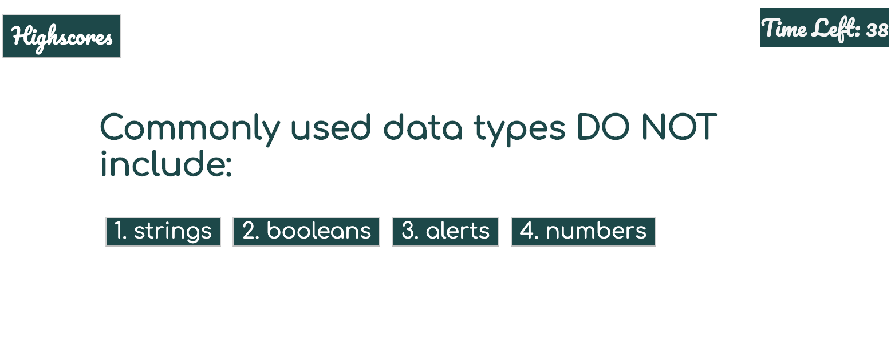

# CodeQuiz

This application is a timed, multiple-choice quiz designed to test the user's knowledge of basic JavaScript concepts. The user has 10 seconds per question. Time will be deducted for incorrect answers. At the end of the quiz (when the time is up, or when the user has submitted answers for each of the five questions), the user is then prompted to enter their initials. Their initials and score are then stored locally to be accessible from the main page of the quiz.(NOTE: I have not completed the code for this portion yet.) 

<h1>Installation</h1>

Simply navigate to https://juliealmeria.github.io/CodeQuizFinal/ on your computer, tablet or smartphone. No installation required. 

<h2>How to Use</h2>

Read the instructions, then click on the "start" button when you are ready to begin your quiz. For each question that appears, click the answer you think is correct. Remember, 20 seconds will be deudcted for incorrect answers! At the end of the quiz, you will be told your score and prompted to enter your initials to be stored in High Scores.

<h1>Versions</h1>

 Version 1.1.0 - Initial Launch - created and published 12.12.19 

